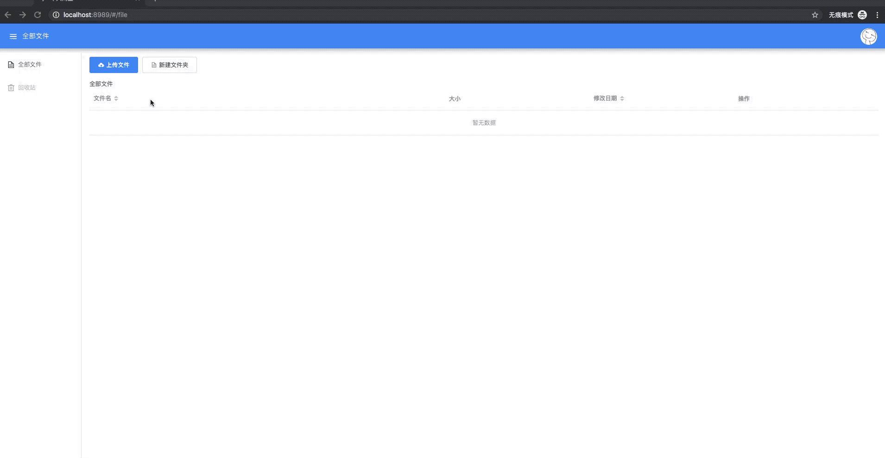

## 介绍
`pnd`全名为`Personal Network Disk`，为了实现一个部署在家庭、寝室等私人生活中的网络存储空间，是一个具有从远程服务器后台下载到私人网盘、家庭文件共享、在线影视观看等功能的方便、快捷的生活助手。

前端页面：[https://github.com/BitInit/pnd-web](https://github.com/BitInit/pnd-web)

演示地址(服务器配置为1核 2G内存 1M带宽，所以该地址只为预览项目)：[http://47.106.219.179:8989](http://47.106.219.179:8989)

## 功能
- [x] 文件及文件夹：增/删/重命名/移动/复制
- [x] 大文件的分块上传，支持文件上传的暂停/恢复；文件上传 md5 校验，如果系统存在该文件，可实现文件的秒传
- [x] 文件下载，部分视频的浏览器简单播放(临时功能)
- [ ] 视频在线播放 (开发中...)
- [ ] 远程资源后台下载
- [ ] ......

## 下载源码或安装包
### 源码构建

``` sh
git clone https://github.com/BitInit/pnd.git

cd pnd
mvn clean package

# pnd/distribution/target" 下可看到构建好的 *.tar.gz 和 *.zip 包
# 运行
bin/startup.sh

# 浏览器访问：http://localhost:8989
```

### 直接下载二进制包
[选择最新的二进制包](https://github.com/BitInit/pnd/releases)

### docker

``` sh
docker pull bitinit/pnd

docker run -d -p 8989:8989 -v [YourOwnPath]:/pnd/data bitinit/pnd

# 浏览器访问：http://<ip>:8989
```

## 项目演示
#### 文件夹管理
文件夹创建、文件重命名、移动、删除



#### 大文件分块上传
计算文件校验码，如果系统有该文件实现快速上传，如果没有就上传该大文件


#### 文件下载，部分视频简单播放


#### 其他功能 待续